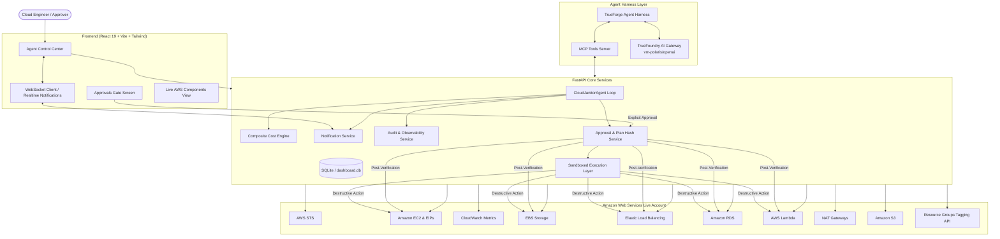

# CloudScope — Autonomous AWS Cloud Cost Cleanup Agent

[](https://opensource.org/licenses/MIT)
[](https://www.python.org/downloads/)
[](https://react.dev/)
[](https://fastapi.tiangolo.com/)
[-success.svg)]()
[]()

> **Theme**: Cloud Cost Janitor  
> **Hackathon**: Agents That Act — TrueFoundry × Polaris / HackCulture  
> **Runtime & Orchestration**: TrueForge (`@truefoundry/trueforge`) & TrueFoundry AI Gateway (`vm-polaris/openai`)

---

## 1. Project Overview

**CloudScope** is an **autonomous AI agent that acts** directly on live AWS cloud infrastructure to eliminate compute and storage waste. Rather than behaving like a passive dashboard that presents charts or a conversational chatbot that merely outputs bash commands, CloudScope connects directly to an **AWS account**, scans live compute and storage resources, calculates monthly financial drain using verified AWS pricing models, provides structured evidence for every suspicious resource, generates a cryptographically sealed cleanup plan, and **halts before any destructive or irreversible action to mandate human approval**.

Once authorized, remediation code is safely executed inside an **isolated subprocess sandbox**, re-verifying live AWS state before and after execution, with every step recorded in an immutable audit trail.

---

## 2. The Problem & Solution

### The Problem
Engineering teams and startups leak thousands of dollars every month on abandoned cloud resources:
- **Idle EC2 instances** left running continuously at under 1% CPU utilization.
- **Orphaned EBS volumes** detached from terminated instances, silently accumulating 100% hourly storage charges.
- **Unused Load Balancers** routing zero traffic with no registered target groups.
- **Unattached Elastic IPs** incurring AWS hourly idle charges.
- **Idle RDS databases** running in staging/test environments without connections.
- **Abandoned NAT Gateways** billing hourly base fees with negligible data processed.
- **Deprecated Lambda runtimes** accumulating costs with security risks.
- **Unversioned / abandoned S3 buckets** with zero lifecycle policies.

### The CloudScope Solution: ACT → STOP → ASK → ACT
1. **Act (Discover & Analyze)**: Connects to live AWS APIs (or interactive Sandbox mode) across 8 resource categories using standard Boto3 credential resolution and AWS Resource Tagging.
2. **Stop (Approval Gate)**: Automatically halts execution before any destructive command.
3. **Ask (Multi-Channel Notification)**: Alerts operators via WebSockets, in-app badges, browser notifications, and email with cost impact, blast radius, and proof.
4. **Act (Sandboxed Remediation)**: Executes authorized actions inside an isolated subprocess sandbox and verifies cloud state transitions in real time.

---

## 3. Core Architecture



---

## 4. Key Differentiators

| Capability | Traditional Chatbots | CloudScope Autonomous Agent |
| :--- | :--- | :--- |
| **Real System Connection** | None (chat simulation) | Live AWS STS, EC2, EBS, ELB, RDS, S3, Lambda, NAT Gateways, Elastic IPs |
| **Action Execution** | Suggests manual shell scripts | Executes verified remediation through isolated subprocess sandbox |
| **Dual Deletion Modes** | None | **1-Click Auto-Terminate on Approval** AND **Direct Component Deletion Modal** |
| **Safety Invariant** | Uncontrolled or no actions | **Multi-point Human Approval Gate** with cryptographic SHA-256 plan hashing |
| **Live Account Visibility** | None | Shows all active running infrastructure immediately upon login |
| **Elastic Service Discovery**| Fixed service hardcoding | Discovers ANY running AWS service via AWS Resource Tagging API |
| **Cost Source Attribution** | Guessed or fabricated | Transparently distinguishes Cost Explorer vs verified AWS pricing models |
| **Production Safeguards** | None | Detects production tags (`env=prod`) and downgrades recommendations to `review_required` |
| **Auditability** | Ephemeral chat logs | Immutable database audit trail recording every event, user, and duration |

---

## 5. Non-Negotiable Safety Gate & Dual Deletion Architecture

CloudScope enforces enterprise-grade safety invariants for all destructive operations:

### Remediation Pathways
1. **Autonomous Teardown on Permission ("Approve & Terminate Now")**:
   - The agent discovers wasteful resources, computes monthly financial drain, generates an immutable cleanup plan, and stops at the Human Approval Gate.
   - Operators review blast radius and click **"Approve & Terminate Now"**.
   - Permission is recorded and the agent **automatically executes** sandboxed termination in real-time, verifying cloud state transitions in AWS.

2. **Direct Component Management ("1-Click Component Delete")**:
   - Operators can inspect live infrastructure across all services directly in the **Live Running Components** view.
   - Every active resource features an interactive **Delete** button with a high-security confirmation modal, pre-verification check, and sandboxed execution.

### Security Invariants:
- **Cryptographic Plan Hashing**: SHA-256 hash computed over sorted candidate IDs, resource types, and actions. Any modification to the plan invalidates previously granted approvals.
- **Expiration Enforcement**: Approvals expire automatically after 2 hours.
- **Pre-Deletion State Verification**: Immediately before execution, re-queries AWS APIs to confirm the resource still exists and is in the target state.
- **Zero Secret Exposure**: Sandboxed execution scripts run in isolated subprocesses with all API keys (`OPENAI_API_KEY`, `TRUEFOUNDRY_API_KEY`, database credentials, session secrets) scrubbed from the environment.
- **Post-Execution State Verification**: Re-queries AWS to confirm the resource successfully transitioned to `terminated`, `deleted`, or detached.

---

## 6. Project Structure

```
├── backend/
│   ├── app/
│   │   ├── analyzers/
│   │   │   ├── ec2_analyzer.py          # Idle EC2 & CloudWatch metrics analyzer
│   │   │   ├── ebs_analyzer.py          # Orphaned unattached EBS analyzer
│   │   │   ├── elb_analyzer.py          # Inactive Load Balancers analyzer
│   │   │   ├── rds_analyzer.py          # Idle RDS database instances analyzer
│   │   │   ├── lambda_analyzer.py       # Deprecated runtime Lambda analyzer
│   │   │   ├── s3_analyzer.py           # Unused / unversioned S3 buckets analyzer
│   │   │   ├── nat_gateway_analyzer.py  # Abandoned NAT Gateway analyzer
│   │   │   ├── elastic_ip_analyzer.py   # Unattached Elastic IP analyzer
│   │   │   └── global_resource_scanner.py # Dynamic discovery via Resource Tagging API
│   │   ├── agent_loop.py                # 11-stage autonomous agent execution loop
│   │   ├── agent_llm.py                 # TrueFoundry AI Gateway (Polaris) client
│   │   ├── approval_service.py          # Approval gate, plan hashing & execution
│   │   ├── audit_service.py             # Immutable audit trail recorder
│   │   ├── aws_session.py               # Standard Boto3 credential resolution & STS
│   │   ├── cost_engine.py               # CostEstimator abstraction & AWS benchmarks
│   │   ├── crypto.py                    # Fernet AES-128-CBC encryption for credentials
│   │   ├── database.py                  # SQLAlchemy engine & SQLite persistence
│   │   ├── demo_sandbox.py              # Zero-setup offline AWS environment simulator
│   │   ├── main.py                      # FastAPI application entrypoint
│   │   ├── mcp_server.py                # Model Context Protocol server for TrueForge
│   │   ├── models.py                    # Database models (Plans, Audit, Users, Approvals)
│   │   ├── notification_service.py      # WebSocket, Browser Notifications & SES
│   │   ├── routes.py                    # REST & WebSocket API endpoints
│   │   ├── sandbox.py                   # Subprocess sandbox with env scrubbing
│   │   └── schemas.py                   # Pydantic validation schemas
│   └── tests/                           # 32 unit & integration tests (100% passing)
├── frontend/
│   ├── src/
│   │   ├── components/Sidebar.jsx       # Navigation & live AWS account badge
│   │   ├── pages/
│   │   │   ├── AgentControlCenter.jsx   # Live WebSocket stream & approval banner
│   │   │   ├── Dashboard.jsx            # Top metrics, savings overview, and quick actions
│   │   │   ├── ApprovalsPage.jsx        # Human Approval Gate & sandboxed execution
│   │   │   ├── ResourcesPage.jsx        # Filterable live infrastructure table & direct delete
│   │   │   ├── CostPage.jsx             # Transparent cost source breakdown
│   │   │   ├── CleanupPlanPage.jsx      # Teardown plan & cryptographic hash
│   │   │   ├── AuditTrailPage.jsx       # Immutable governance event timeline
│   │   │   ├── Settings.jsx             # Agent mode switch (READ_ONLY vs ACTION)
│   │   │   └── Login.jsx                # AWS IAM direct authentication
│   │   ├── api.js                       # REST & WebSocket client
│   │   └── App.jsx                      # React Router configuration
├── docs/                                # Detailed architectural specifications
├── trueforge.yaml                       # TrueForge harness & MCP configuration
└── .env.example                         # Environment variables template
```

---

## 7. Setup & Running Locally

### Prerequisites
- Python 3.11+
- Node.js v18+ & npm
- Valid AWS credentials (IAM role, profile, or access keys) *or* run in Demo Mode

### Step 1: Configure Environment
```bash
cp .env.example .env
```
Edit `.env` with your TrueFoundry API credentials and AWS configuration:
```env
TRUEFOUNDRY_API_KEY=your_key_here
TRUEFOUNDRY_BASE_URL=https://gateway.truefoundry.ai
TRUEFORGE_MODEL=vm-polaris/openai
AWS_REGION=us-east-1
```

### Step 2: Install Backend Dependencies & Start Server
```bash
python -m pip install -r backend/requirements.txt
python -m uvicorn backend.app.main:app --host 0.0.0.0 --port 8000 --reload
```

### Step 3: Run Frontend Development Server
```bash
cd frontend
npm install
npm run dev
```
Open your browser at `http://localhost:5173`.

### Step 4: Run via TrueForge Harness
```bash
npx @truefoundry/trueforge
```

### Step 5: Run Test Suite
```bash
python -m pytest backend/tests -v
```
All **32 test cases (100% passing)** validate:
- Pre-deletion checks and direct termination safety
- Approval gates, SHA-256 plan hash invalidation, and timeout enforcement
- 8 analyzer modules (EC2, EBS, ELB, RDS, Lambda, S3, NAT GW, Elastic IPs)
- Dynamic resource discovery via AWS Resource Tagging API
- Sandbox subprocess isolation and environment variable scrubbing

---

## 8. Hackathon AI Coding Assistant Disclosure

In full compliance with the hackathon rules:
- **Google Antigravity IDE (Gemini 3.8 Flash)** was utilized as an AI coding pair programmer during development for architecture structuring, code generation, test authoring, and documentation.
- The complete project architecture, state machine, approval gate, and sandbox execution layers were built and verified during the hackathon period.
