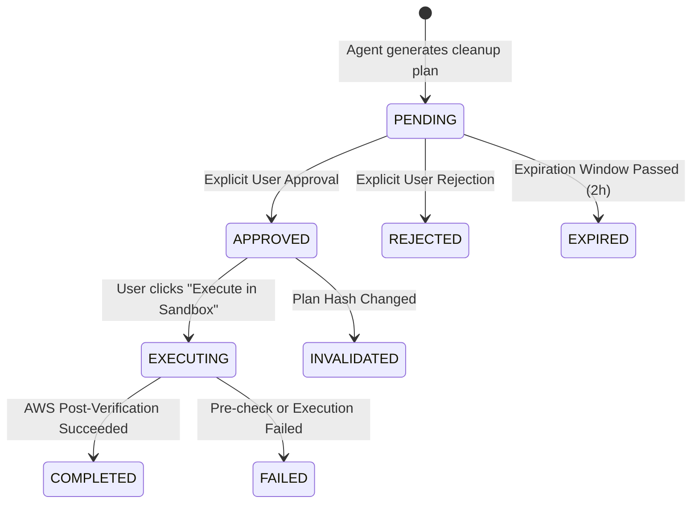

# CloudScope Human Approval Gate

## Overview
The **Human Approval Gate** is the core safety invariant of CloudScope. The agent **NEVER** performs an irreversible destructive action autonomously.

---

## State Transition Lifecycle

---

## Approval Record Schema

| Field | Type | Description |
| :--- | :--- | :--- |
| `id` | UUID | Unique approval request identifier |
| `run_id` | UUID | Associated agent scan run |
| `plan_id` | UUID | Associated cleanup plan |
| `user_id` | String | User assigned or resolving the approval |
| `aws_account_id` | String | Target AWS account |
| `region` | String | Target AWS region |
| `resource_id` | String | Exact resource ID (e.g. `i-1234567890abcdef0`) |
| `resource_type` | String | `ec2`, `ebs`, `elb` |
| `action` | String | Specific destructive action, e.g. `terminate_ec2` |
| `plan_hash` | SHA-256 | Cryptographic seal of the plan version |
| `risk_level` | String | `HIGH` or `MEDIUM` |
| `evidence_json` | JSON | Concrete proof of inactivity / waste |
| `dependencies_json` | JSON | Attached volumes, snapshots, listeners |
| `estimated_monthly_savings` | Float | Financial impact |
| `status` | Enum | `PENDING`, `APPROVED`, `REJECTED`, `EXPIRED`, `EXECUTING`, `COMPLETED`, `FAILED` |
| `created_at` | DateTime | Creation timestamp |
| `expires_at` | DateTime | Expiration timestamp (default 2 hours) |
| `resolved_at` | DateTime | Timestamp of user decision |

---

## What Cannot Authorize Execution

- Casual conversation (e.g., "looks good", "delete it if safe").
- Stale or expired tokens.
- Modified plans where the plan hash has diverged.
- READ-ONLY mode (requires explicitly toggling ACTION mode with a safety confirmation).
