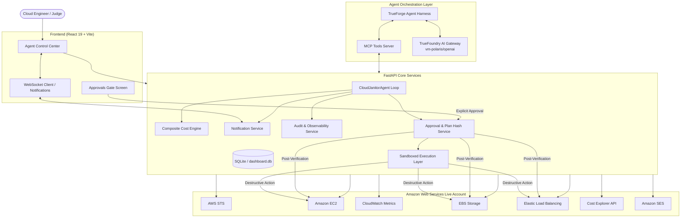

# CloudScope Architecture

## Overview
**CloudScope** is an autonomous cloud cost optimization agent built for the **Agents That Act** hackathon (TrueFoundry × Polaris / HackCulture). Rather than behaving like an observational dashboard or conversational chatbot that merely suggests bash commands, CloudScope is an **Agent That Acts**: it autonomously inspects live AWS accounts, reasons over idle compute, orphaned storage, and unused balancers, computes transparent monthly savings, generates a cryptographically sealed teardown plan, and halts before any irreversible action to require explicit human approval.

---

## System Diagram

---

## Core Architectural Pillars

### 1. TrueForge Orchestration Layer
CloudScope uses TrueForge (`npx @truefoundry/trueforge` and `trueforge.yaml`) as the vendor-neutral agent harness:
- Configures tools through standard **Model Context Protocol (MCP)**.
- Connects model reasoning to the **TrueFoundry AI Gateway** (`vm-polaris/openai`).
- Enforces Human-in-the-Loop approval checkpoints on destructive action tools (`aws_execute_approved_action`).

### 2. Standard Boto3 Credential Resolution
The agent never requires pasting secret keys when environment credentials exist. It uses standard AWS SDK resolution:
1. Attached IAM Role (e.g. EC2/ECS metadata or EKS IRSA)
2. Environment variables (`AWS_ACCESS_KEY_ID`, `AWS_SECRET_ACCESS_KEY`, `AWS_SESSION_TOKEN`)
3. Local AWS Profile (`AWS_PROFILE`)
4. Explicit AES-encrypted credentials in storage

Caller identity is validated on every run using `sts.get_caller_identity()`.

### 3. Pluggable Resource Analyzers
Analyzers prioritize the Cloud Cost Janitor theme:
- **IdleEC2Analyzer**: Evaluates state, CloudWatch CPU utilization over a 7-day observation window, attached volume dependencies, and production safeguard tags.
- **OrphanedEBSAnalyzer**: Identifies unattached volumes in `available` state, measures volume age, checks snapshot lineage, and calculates ongoing passive storage fees.
- **UnusedLoadBalancerAnalyzer**: Scans Application and Network Load Balancers with zero target groups, zero registered instances, or all unhealthy targets.

### 4. Transparent Cost Engine
Adheres to zero-fabrication standards:
- Distinguishes **AWS Cost Explorer billing data**, **AWS pricing-derived estimates** (published regional on-demand rates), **Calculated estimates**, and **Unavailable**.
- Every cost carries explicit source attribution, calculation method, and confidence score.

### 5. Multi-Point Human Approval Gate
Irreversible cloud actions (termination, deletion) are mathematically blocked from executing until:
- An explicit user approval decision (`APPROVED`) is recorded.
- The approval timestamp is within expiration limits (2 hours).
- The cryptographic SHA-256 plan hash matches the active plan.
- Live pre-deletion verification confirms the resource exists and matches target state.

### 6. Subprocess Sandbox Execution
Generated cleanup code runs inside an isolated subprocess:
- Strict execution timeout (25 seconds).
- Sanitized environment stripping all API keys (`OPENAI_API_KEY`, `TRUEFOUNDRY_API_KEY`, database keys).
- Captured stdout, stderr, exit codes, and post-execution AWS verification.
