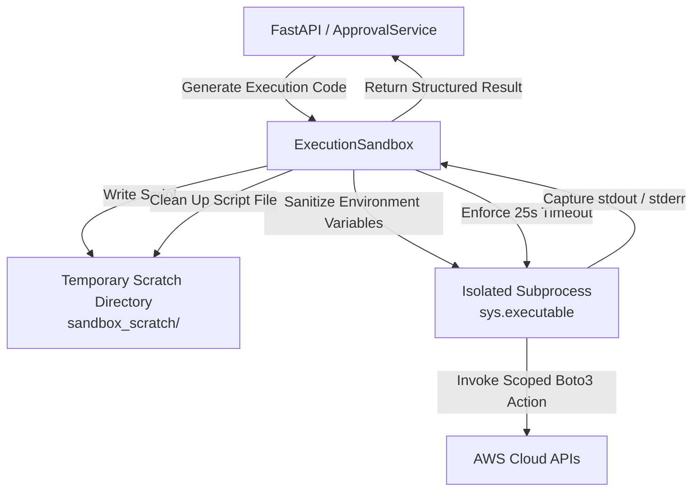

# CloudScope Sandbox Execution Layer

## Overview
When an approved remediation action is authorized by an engineer, CloudScope generates standalone, auditable Python execution code to interface with AWS APIs. To guarantee safety and prevent host contamination, **generated code is never executed directly in the host application process**.

---

## Sandbox Architecture

---

## Isolation Guarantees

1. **Subprocess Boundary**: Generated code executes in a separate process spawned via `subprocess.Popen([sys.executable, script_path])`.
2. **Environment Scrubbing**: Sensitive environment variables are removed prior to spawning:
   - `OPENAI_API_KEY`
   - `TRUEFOUNDRY_API_KEY`
   - `SECRET_KEY`
   - `JWT_SECRET`
   - `DATABASE_URL`
3. **Execution Timeout**: Enforced hard limit (default: 25 seconds). If a hanging API call or network partition occurs, the process is killed (`process.kill()`).
4. **Captured Output**: Captures standard output, standard error, exit code, and execution time in milliseconds.
5. **Post-Execution Cleanup**: Temporary script files are removed immediately upon execution completion or failure.
